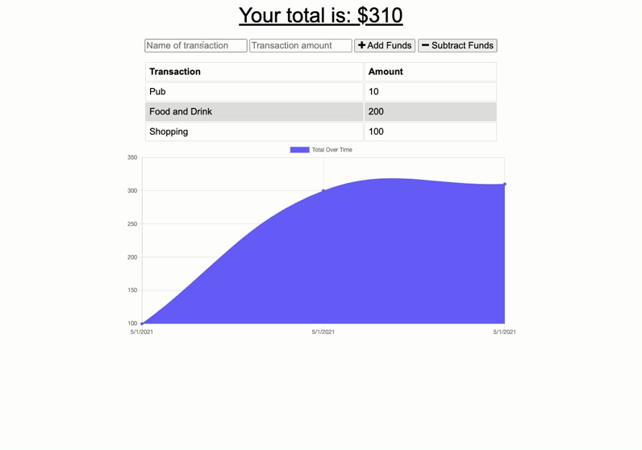

# Budget Tracker

# Table of Contents
- [Description](#description)
- [Installation](#installation)
- [Instructions](#instructions)
- [Credits](#credits)
- [Contributions](#contributions)
- [Tests](#tests)
- [Questions](#questions)
- [License](#license)
---
## Screenshot of deployed app:

## Description:

This application dynamically tracks a user's cashflow; a balance is generated for funds paid in, and every expenditure is recorded and taken off of the balance. A chart provides visual representation of expenditure over time and updates automatically. 

Most importantly the app works offline, JavaScript service-worker and web-manifest scripts handle offline caching of files and data. When the app is able to connect to a network again, the data synchronises with MongoDB.

---

## Installation:
* node.js
* express npm
* mongoose npm
* compression npm
* path npm
* mongodb

---
## Instructions:
1. Fork the repo
2. Run mongod in the terminal to initialise the db
3. Start the server - run npm start or node server in terminal
4. Setup MongoDB Atlas cluster (for deployment only)

---
## Credits:
This work is my own.

---
## Contributions:
Please make a pull request for any bug fixes or suggestions.

---
## Tests:
Currently none.

---
## Questions:  
If you have any questions please find my Github username below:  

* MJ-0001

---
## License:  

MIT  

  

https://opensource.org/licenses/MIT

---